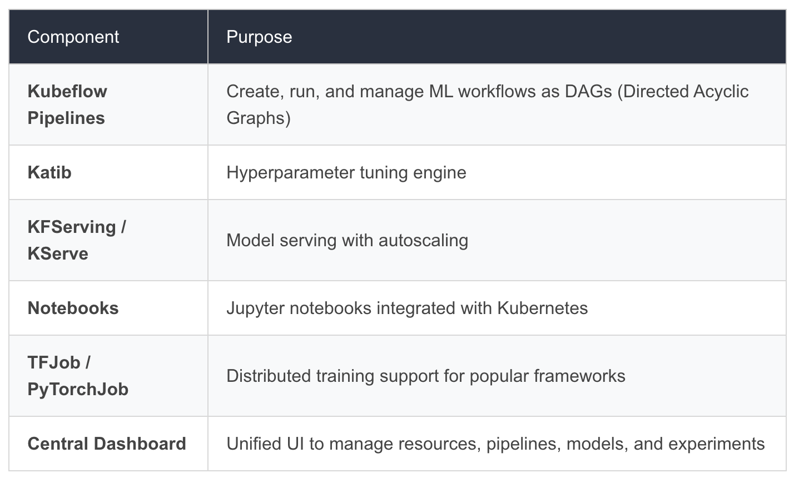

# MLOpsDemo
MLOPS Demo Code
# MLOPS Module

## Introduction to MLOPS:

## MLOPS Tools Overview:

### Kubeflow:

Kubeflow is an open-source platform designed to orchestrate machine learning workflows on Kubernetes, enabling scalable and reproducible ML operations.

Kubeflow Components:

When to use:
- Working on Medium/Large Project to provide an end-to-end platform to ML Teams
- When working with Kubernetes based environments or any Cloud, On-Prem or Hybrid environments

Caution:
- Setup and operation require significant Kubernetes expertise and computing resources; 
- Documentation may be weak in some advanced or custom scenarios

- [kubeflow](https://www.kubeflow.org/)
- [kubeflow article](https://kodekloud.com/blog/running-ai-ml-workloads-on-kubernetes-using-kubeflow-a-beginners-guide/)
- [ChatGPT on Kubernetes](https://openai.com/index/scaling-kubernetes-to-7500-nodes/)

### MLFlow:

MLFlow is an open-source framework for managing the complete machine learning lifecycle, helping teams track experiments, package code, and streamline deployment.

MLFLow Components:

- Tracking: Tracking is an API and UI for logging parameters, code versions, metrics, and artifacts
- Projects: Projects are a standard format for packaging reusable data science code
- Models: Models offer a convention for packaging machine learning models in multiple flavors, and a variety of tools to help you deploy them
- Registry: Registry offers a centralized model store, set of APIs, and UI, to collaboratively manage the full lifecycle of an MLflow Model, also show model lineage (which experiment and run produced the model), model versioning and promotion

Note: MLFlow is also integrated in Sagemaker, see below [References](#References)

- [MLFlow Quickstart](https://mlflow.org/docs/latest/ml/tracking/quickstart/)
- [MLFlow Components](https://www.mlflow.org/docs/2.1.1/concepts.html)
- [MLFlow Experiment Comparison](https://mlflow.org/docs/2.21.3/getting-started/quickstart-2/)

When to use:
- Can be used on any Project scale ranging from personal to Production grade
- Teams seeking framework-agnostic and lightweight ML lifecycle management

Caution:
- Lacks native Pipeline Orchestration and built-in Kubernetes integration compared to Kubeflow Setup. Also, focus is more experiment-centric rather than full workflow automation
- May not be suitable for teams looking for Enterprise-Grade model deployment, monitoring and cloud-based scaling

### AWS Sagemaker:

AWS Sagemaker is a fully managed, end-to-end platform that enables model building, training, deployment, and monitoring at scale in the AWS cloud

Key Features:
- One-stop environment: Integrates data preparation, feature engineering, model training, tuning, hosting, and monitoring within a unified AWS platform.
- Managed environments: Provides pre-built Jupyter/Studio environments, customizable containers, and infrastructure automation.
- Integrated MLOps: Built-in tools for CI/CD(Sagemaker Pipelines), automation, audit trails, and lineage for all ML artifacts and actions
    - Model Registry helps to Store, catalog, and manage model versions with approval workflows, lineage for all ML artifacts and actions
    - Sagemaker Pipelines provides Visual and Code Driven Pipeline creation enabling swift automation
    - Built-in MLFlow Integration

When to use:
- Preference for a fully managed, end-to-end ML Platform with built-in tools
- For Teams seeking minimal infrastructure management, user-friendly visual environments and enterprise support

Caution:
- Provider/Vendor Lock-In with AWS
- Learning Curve might be steep depending on the features selected

Demo - Example Notebook:
https://github.com/aws/amazon-sagemaker-examples/blob/main/introduction_to_amazon_algorithms/linear_learner_mnist/linear_learner_mnist.ipynb

#### AWS Sagemaker Jargon:

Sagemaker Vs Bedrock

- Studio: Comprehensive Web-Based IDE for Machine Learning end-to-end Development

- Notebooks: Stand-Alone instances of Jupyter Notebooks

- Canvas: AWS No-Code Platform for ML along with AI-powered assistance from Amazon Q Developer

- Domain: Covers all the above features in a single place. A domain is an environment for your team to access SageMaker resources. A domain consists of a list of authorized users and users within a domain can share notebook files and other artifacts with each other. One account can have either one or multiple domains

- HyperPod Clusters: SageMaker HyperPod clusters are purpose-built, scalable, and resilient clusters designed for accelerating large-scale distributed training and deployment of complex machine learning models like LLMs, diffusion models, and other foundation models

##### References:
- [AWS Sagemaker Studio](https://aws.amazon.com/sagemaker/ai/studio/)
- [AWS Sagemaker Canvas](https://aws.amazon.com/sagemaker/ai/canvas/)
- [Studio Vs Notebooks](https://docs.aws.amazon.com/sagemaker/latest/dg/notebooks-comparison.html)
- [Sagemaker Domain](https://docs.aws.amazon.com/sagemaker/latest/dg/gs-studio-onboard.html)
- [MLFlow Tracking with Sagemaker](https://docs.aws.amazon.com/sagemaker-unified-studio/latest/userguide/sagemaker-experiments.xml.html)

## CI-CD for ML Pipelines:

TBD
