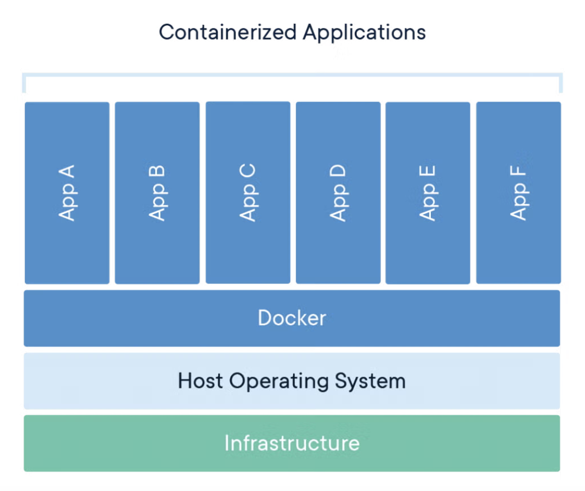

## Tools/Utilites Required:
- Git
- Docker Desktop
- Python
- Dockerhub Account - Register your free account at hub.docker.com

## Containers 101:

- A Container Image is a package that bundles application code and all it dependencies
- A Container is simply an isolated process with all of the files it needs to run
- A Container is a running instance of a container image just like how an object is an instance of a class in OOP

Containers are:
- Portable: They can run in cloud, on-prem virtually anywhere
- Light-Weight: Does not need a entire operating system (kernel, hardware driver, programs, GUI software etc)
- Independent: Deleting a container does not affect other containers
- Self-Contained: No dependencies on host machine
- Isolated: They run in their own shells/space that other containers doesn't have access to

### References:
- [What is a container](https://www.docker.com/resources/what-container/)
- [Containers 101](https://docs.docker.com/get-started/docker-concepts/the-basics/what-is-a-container/)

## Steps to Containerize your App

1. Clone the Repo

        git clone https://github.com/poladinesh/MLOpsDemo.git

2. Switch to src-container folder

        cd src-container

3. Install & Activate Python Virtual Environment

    For Mac/Linux:

        python -m venv .
        source ./bin/activate

    For Windows:

            python -m venv .
            .\Scripts\activate

4. Inspect & Run the Code

        pip install -r requirements.txt
        uvicorn main:app --reload

> [!NOTE]
Before Containerizing the app, make sure to expose the app as an API Endpoint

5. Containerize / Generate Dockerfile

        docker init

6. Build the Container Image
        
        docker build -t mlops-demo:v1 .

> [!IMPORTANT]
Above command add the platform(architecture) type automatically based on where the `docker build` command is run. 

To make sure it supports x86_64 architecture (which is more common) and not arm-based architecture use below command.

        docker buildx build --platform linux/amd64 -t mlops-demo:v2 .

> [!IMPORTANT]
Please look at docs here [Multiplatform build](https://docs.docker.com/build/building/multi-platform/#build-multi-platform-images) if you are building on ARM-Based Laptops/Machines

7. Tag & Push the Container Image with Container Registry Name (here, we use docker hub)

        docker image tag mlops-demo:v2 poladinesh/mlops-demo:v2
        docker push poladinesh/mlops-demo:v2

Requires `docker login` # if not already logged in - requires dockerhub login

8. Verify the latest container image in Dockerhub

9. Remove local Container Images and pull from Dockerhub

        docker images | grep -i mlops
        docker rmi mlops-demo:v2
        docker pull poladinesh/mlops-demo:v2

10. Run the downloaded container image from Dockerhub

        docker run -p 8000:8000 mlops-demo:v2

> [!WARNING] 
> Exit code 255 - architecture mismatch:
    If the Docker image is built for a different architecture than the host system (e.g., x86_64 image on an ARM64 instance), it can lead to an "exec format error" and a 255 exit code.        

11. Access the app at http://localhost:8000 or http://localhost:8000/docs

12. Now we can deploy the container image anywhere we want making this platform/cloud-provider agnostic, for example we can deploy this on a ECS Cluster

[Placeholder for Container Deployment on a AWS ECS Cluster]

## Best Practices:

- For Base Images, Use tags such as Official, Verified Publisher or OSS
- Use the following exec format in your Dockerfile, see why [here](https://www.docker.com/blog/docker-best-practices-choosing-between-run-cmd-and-entrypoint/)

                CMD ["uvicorn", "main:app", "--host=0.0.0.0", "--port=8000"]

- For all other best practices, see [here](https://docs.docker.com/build/building/best-practices/)

- Regarding the Serialization error during our Office Hours we got, check this link for more explanation [here](https://stackoverflow.com/questions/71102658/how-can-i-return-a-numpy-array-using-fastapi)