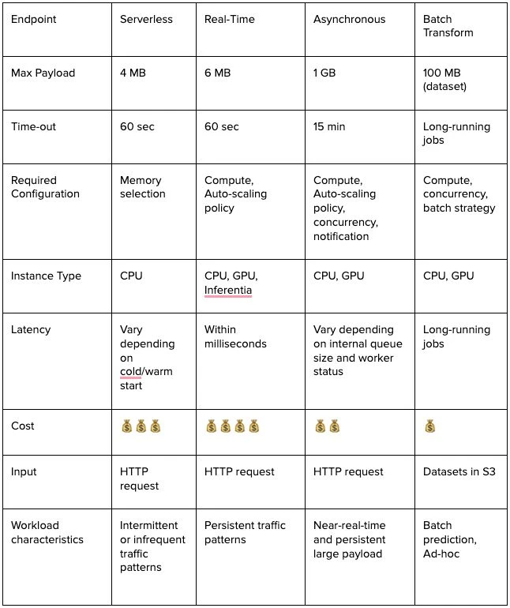

## AWS Sagemaker AI : called using SageMaker API Invoke Endpoint
- **Realtime / hosted endpoint or hosted endpoint with ASG** (underlying sagemaker using ec2 instances with docker to host the ml app): Real-time inference is ideal for inference workloads where you have interactive, low latency requirements.
- **Serverless**: Use Serverless Inference to deploy models without configuring or managing any of the underlying infrastructure. This option is ideal for workloads which have idle periods between traffic spurts and can tolerate cold starts.
- **Batch Inference**: Used for long-running Batch Transform jobs to handle large payloads using a batch strategy (mini-batches of up to 100 MB each)
- **Asynchronous Inference**: Queues incoming requests and processes them asynchronously. This option is ideal for requests with large payload sizes (up to 1GB), long processing times (up to one hour), and near real-time latency requirements.

### Key Concepts:

**Session:** Provides a collection of methods for working with SageMaker resources

**Estimator:** Encapsulates training on Sagemaker
    - You start your training script by calling `fit()` on Estimator

**Predictor:** Deploy Model & make Predictions
    - Provide real-time inference and transformation using Python data-types against a SageMaker endpoint

**Transformers:** Encapsulate batch transform jobs for inference on SageMaker

**Realtime Endpoint:** Requires additional configuration to perform Auto-Scaling, is not included out-of-the-box

**Serverless Inference:** Requires Serverless Inference Configuration to be passed to the deploy method. If passed empty, goes back to default values. More details [here](https://sagemaker.readthedocs.io/en/stable/overview.html#sagemaker-serverless-inference)

**Batch Inference:** Create a transformer object and then call `transform()` to start a transform job

**Sagemaker Automatic HyperParameter Tuning:** Perform HyperParameter tuning jobs. A hyperparameter tuning job finds the best version of a model by running many training jobs on your dataset using the algorithm with different values of hyperparameters within ranges that you specify. More details [here](https://sagemaker.readthedocs.io/en/stable/overview.html#sagemaker-automatic-model-tuning)

**Inference Pipelines:** Create a Pipeline for realtime or batch inference comprising of one or multiple model containers. Input for first container will be ouput for second container, this helps in processing the raw data passed to predictor endpoint before sending a result back

**Sagemaker Pipelines**: Serverless Workflow Orchestration service built for MLOPS Automation with drag-and-drop UI

### Inference Options Cheatsheet:

### Deployment Methods:

- Jupyter Notebook from Sagemaker Studio

- CI-CD

### Deployment Strategy:

Deployment guardrails are a set of model deployment options in Amazon SageMaker AI Inference to update your machine learning models in production. More details [here](https://docs.aws.amazon.com/sagemaker/latest/dg/deployment-guardrails.html)

- Local: mostly for experimentation, more details [here](https://sagemaker.readthedocs.io/en/stable/overview.html#local-mode)

- Blue-Green Deployments:
    - All-at-Once: Shifts all of the traffic to the new fleet in a single step
    - Linear: A fixed portion of the traffic shifts in a pre-specified number of equally spaced steps
    - Canary: Traffic shifts in two steps. The first (canary) step shifts a small portion of the traffic followed by the second step, which shifts the remainder of the traffic

- Rolling Deployments: Update endpoint by gradually shifting traffic in small batches that can be specified

- Shadow Tests: Sends a portion of production traffic to shadow variant without sending the responses back to calling users/application. This way, you can compare performnce between the shadow variant with production variant. But, limited to Realtime inference only at this time. More details [here](https://docs.aws.amazon.com/sagemaker/latest/dg/shadow-tests.html)

Autorollback Configuration and Monitoring: 

Amazon CloudWatch alarms are a prerequisite for using baking periods in deployment guardrails. You can only use the auto-rollback functionality in deployment guardrails if you set up CloudWatch alarms that can monitor an endpoint. If any of your alarms trip during the specified monitoring period, SageMaker AI initiates a complete rollback to the old endpoint to protect your application. If you do not have any CloudWatch alarms set up to monitor your endpoint, then the auto-rollback functionality does not work during your deployment

More details [here](https://docs.aws.amazon.com/sagemaker/latest/dg/deployment-guardrails-configuration.html)

Sagemaker Python SDK:
https://sagemaker.readthedocs.io/en/stable/overview.html#using-the-sagemaker-python-sdk

https://docs.aws.amazon.com/sagemaker/latest/dg/deploy-model.html

Using Sci-Kit Learn with Sagemaker Python SDK:
https://sagemaker.readthedocs.io/en/stable/frameworks/sklearn/using_sklearn.html

Other ML Frameworks supported by Sagemaker Python SDK:
https://sagemaker.readthedocs.io/en/stable/frameworks/index.html

Autoscaling:
https://docs.aws.amazon.com/sagemaker/latest/dg/endpoint-auto-scaling.html

Sagemaker Builtin Algorithms:
https://docs.aws.amazon.com/sagemaker/latest/dg/algos.html

Inference Types:
https://caylent.com/blog/sagemaker-inference-types

Sagemaker Examples:
https://github.com/aws/amazon-sagemaker-examples